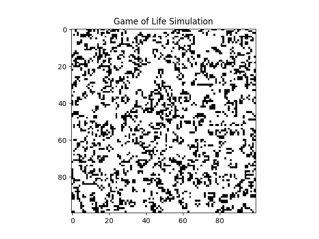

# 🎮 Game of Life Implementation for GPU Parallel Processing

<div style="text-align: center;">
  
</div>


## 📝 Overview

This project implements Conway's Game of Life using three different parallel processing frameworks to compare their performance and ease of use. The Game of Life is a cellular automaton simulation that follows simple rules but can produce complex emergent behavior, making it an excellent candidate for parallel computation.

### 🛠️ Implementations

1. **PyTorch**: 🔥 Utilizing GPU acceleration through PyTorch's tensor operations.
2. **Triton**: 🚀 Leveraging OpenAI's Triton language for writing highly efficient GPU kernels.
3. **PyCUDA**: 🐍 Using Python bindings for NVIDIA's CUDA parallel computation API.

## 📋 Prerequisites

Ensure you have a CUDA-capable GPU and the following dependencies installed:

```bash
# Install PyTorch (CUDA version may vary based on your system)
pip install torch torchvision torchaudio

# Install Triton
pip install git+https://github.com/openai/triton.git

# Install PyCUDA
pip install pycuda
```

## 🌟 Key Features

- 🔄 Parallel implementation of Game of Life rules
- 📊 Performance comparison between PyTorch, Triton, and PyCUDA
- 🔧 Customizable grid sizes and iteration counts
- 🖼️ Visualization options (can be added for each implementation)

## 🏎️ Performance Considerations

- PyTorch: 👨‍💻 Easy to use, good for rapid prototyping
- Triton: ⚡ Potentially faster than PyTorch for custom kernels, requires more setup
- PyCUDA: 🎛️ Offers fine-grained control, but has a steeper learning curve

## 🤝 Contributing

Contributions are welcome! Please feel free to submit a Pull Request.

<hr>

Created by Manith Jayaba 💻
